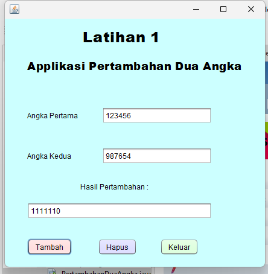

# Aplikasi Pertambahan Dua Angka
 
Aplikasi Pertambahan Dua Angka adalah sebuah aplikasi berbasis Java yang membantu pengguna untuk menghitung hasil penjumlahan dari dua angka yang diinputkan. Aplikasi ini memberikan cara yang cepat dan mudah untuk mengetahui hasil dari penjumlahan dua angka.

# Keunggulan Aplikasi

- *Menjumlahkan Dua Angka: Aplikasi ini secara otomatis menghitung hasil penjumlahan dari dua angka yang diinput.
- *Antarmuka Pengguna yang Sederhana: Dibangun menggunakan Java Swing, aplikasi ini menawarkan antarmuka yang mudah digunakan dan dipahami oleh semua kalangan pengguna.
- *ecepatan Hasil: Hasil penjumlahan langsung ditampilkan setelah kedua angka dimasukkan, memberikan pengalaman pengguna yang cepat dan efisien.

# Pembuat Aplikasi
Muthya Adylla - 2210010476 - Latihan 2

# Fitur

Aplikasi ini menawarkan beberapa fitur utama:

1. *Penjumlahan Dua Angka*
Menghitung hasil penjumlahan dua angka yang diinput oleh pengguna. Cukup masukkan dua angka, klik tombol "Hitung", dan hasil penjumlahan akan langsung tampil.

2. *Antarmuka Pengguna yang Mudah*
Dibangun menggunakan Java, aplikasi ini memiliki tampilan yang sederhana dengan dua kolom untuk memasukkan angka dan sebuah tombol untuk memulai perhitungan. Hasilnya akan langsung muncul di layar.

3. *Validasi Input*
Aplikasi ini memverifikasi bahwa input yang dimasukkan adalah angka yang valid. Jika pengguna memasukkan karakter selain angka, aplikasi akan menampilkan pesan kesalahan yang jelas dan mudah dimengerti.

## Cara Menjalankan

1. Clone repositori ini ke dalam komputer Anda atau unduh sebagai ZIP.
2. Buka proyek di IDE pilihan Anda.
3. Pastikan Anda mengatur JDK yang benar di IDE Anda.
4. Jalankan PenghitungUmurFrame untuk memulai aplikasi.

# Demo
 
